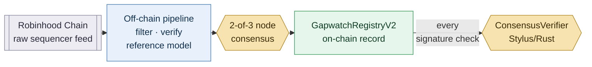

# Gapwatch


Independent on-chain verification for Robinhood Chain corporate actions — watches the raw sequencer feed for stock-token multiplier updates, re-computes them against an independent Reference Model, and seals the result on-chain behind a 2-of-3 node consensus. Purpose-built for Robinhood Chain: every layer depends on a chain-native capability (the ArbOS compliance-filtering precompile, the raw sequencer feed, Stylus) and has no meaningful equivalent on a generic EVM chain.

**Status:** Core pipeline and consensus layer live on mainnet; ongoing hardening per Test Coverage & Known Limitations below.

## 🌐 Live Demo

https://gapwatch-app.vercel.app

**Current mainnet contract:** GapwatchRegistryV2 `0x556e1cA65a003b1ffce58eDd14CE3c0c6F520137` · Full deployment history, tx hashes, and constructor args: [deployment.json](./deployment.json)

**Deployed on Robinhood Chain (mainnet + testnet)**

| Network | Contract | Address |
|---|---|---|
| Mainnet (4663) | ConsensusVerifier (Stylus) | `0x6A7061D3f754BB594ed5092815Ae9bD71DD185b7` ⚠️¹ |
| Mainnet (4663) | GapwatchRegistryV2 | `0x556e1cA65a003b1ffce58eDd14CE3c0c6F520137` ⚠️² |
| Mainnet (4663) | MockLendingPool | `0xd3256Ec6193cFD55D8E2028b9caCfABC11BA4E26` |
| Testnet (46630) | GapwatchRegistry (Tier 1+2+2.5) | `0x53f10f96e3F6443e67Af2F1b01144B7e325f006d` |
| Testnet (46630) | MockLendingPool | `0xF764f545B4e6fF8755EEDEE64A0CFCf2Ec08a671` |
| Testnet (46630) | Stylus feasibility scaffold | `0xef33b95c009ca3c7021c294567237ce08679c0f1` ⚠️³ |

> **⚠️ CREATE nonce address collisions — read before citing any address above.**
> CREATE addresses depend only on `(deployer, nonce)`, not on chain id. The same
> deployer wallet is used across several chains, so three of these addresses are
> *also* live contracts belonging to an unrelated project (SpaceFinance, on
> Creditcoin CC3 Testnet). Always qualify by chain when referencing them.
>
> ¹ Same address on Creditcoin CC3 Testnet is SpaceFinance's `AttestorRegistry`.
> ² Same address on Creditcoin CC3 Testnet is SpaceFinance's `Outbox`.
> ³ Same address on Creditcoin CC3 Testnet is SpaceFinance's main contract.
>
> Two now-deprecated testnet registry addresses collided the same way
> (`0x9C22c9F1…` with SpaceFinance's `GuildPool`, `0xE38b8d44…` with its
> `EOAValidator`). Neither is a current deployment and neither appears in
> `deployment.json`. The current testnet registry, both MockLendingPools, and
> the mainnet MockLendingPool have no known collision.

---

## Why Robinhood-Chain-Native

This is not a project ported from another chain. Each design decision maps to a capability that only exists here.

| Problem | Generic EVM approach | Robinhood-Chain-native approach |
|---|---|---|
| Knowing whether a transaction was compliance-filtered | No such concept exists; there is nothing to query | Query the `ArbFilteredTransactionsManager` precompile at `0x74` directly via `isTransactionFiltered(bytes32)` (selector `0x85c733a4`) |
| Seeing a transaction *before* it is excluded | Standard RPC and block explorers only ever show what made it into a block — an excluded transaction leaves no receipt and no log | Subscribe to the raw sequencer feed, where candidate transactions are visible before `extraPreTxFilter` / `extraPostTxFilter` can exclude them |
| Avoiding a single relayer as the sole writer of on-chain truth | `onlyOwner` / single-role write gate | M-of-N consensus: 2-of-3 independent node signatures verified on-chain before any record is written |
| Executing verification logic outside Solidity | Everything stays in Solidity | Stylus (Rust, WASM) contract called cross-language from Solidity — see the honest note on gas below |

**Honest note on Stylus and gas.** The consensus check is dominated by `ecrecover`, which is an EVM precompile and costs the same whether it is invoked from Solidity or from Stylus. Stylus provides **no gas advantage for this particular workload**, and the difference against an equivalent same-chain Solidity verifier has not been measured (see Honest Disclosures #8). What Tier 4 demonstrates is the cross-language architecture itself — a Solidity contract making a live call into a Rust/WASM contract on this chain — not a gas win.

---

## Architecture

Two things are true on Robinhood Chain at once: the off-chain pipeline sees every candidate transaction on the raw sequencer feed — including ones the chain will exclude and no RPC will ever show — but nothing it concludes becomes on-chain truth without 2-of-3 node signatures. The diagram below shows what crosses that boundary and what never does.



See [docs/architecture.md](./docs/architecture.md) for the full 8-module pipeline and Tier 1–4 contract breakdown.

---

## Core Features

### Filtered-transaction detection
Candidate events are checked against the `ArbFilteredTransactionsManager` precompile at `0x74`. The precompile identity and its exclude-on-filter behaviour are confirmed against Nitro source; whether Robinhood specifically uses those hooks for stock compliance filtering remains an inference (Honest Disclosures #9). Because filtering excludes a transaction *before* it reaches a block, the raw sequencer feed is the only vantage point from which the candidate is visible at all — an ordinary RPC node cannot reconstruct it after the fact.

### M-of-N consensus verification (cross-language)
`recordVerification`, `resolveChallenge` and `reportDiscrepancy` each require 2 valid signatures from 3 fixed node keys. The digest is bound to the record's contents, `address(this)` and `block.chainid`, so a signature set is useless on another contract or another chain; `reportDiscrepancy` additionally carries its own domain-separation tag so a signature set for one function cannot be replayed against another. Verification runs inside a Stylus (Rust) contract, invoked live from Solidity — the registry holds only the verifier's immutable address and trusts its `(passed, validCount, signers)` return.

### Challenge-bond dispute resolution
Every record is written with a posted bond. Anyone — not only a node — may challenge a record within the challenge window by matching that bond. Resolution requires 2-of-3 consensus, and pays both bonds to the winning side via a pull-payment `pendingWithdrawals` balance rather than a direct transfer.

---

## Deployed Contracts

**Robinhood Chain Mainnet (4663)**

| Contract | Address | Explorer |
|---|---|---|
| ConsensusVerifier (Stylus) | `0x6A7061D3f754BB594ed5092815Ae9bD71DD185b7` | [View Contract](https://robinhoodchain.blockscout.com/address/0x6A7061D3f754BB594ed5092815Ae9bD71DD185b7) |
| GapwatchRegistryV2 | `0x556e1cA65a003b1ffce58eDd14CE3c0c6F520137` | [View Contract](https://robinhoodchain.blockscout.com/address/0x556e1cA65a003b1ffce58eDd14CE3c0c6F520137) |
| MockLendingPool | `0xd3256Ec6193cFD55D8E2028b9caCfABC11BA4E26` | [View Contract](https://robinhoodchain.blockscout.com/address/0xd3256Ec6193cFD55D8E2028b9caCfABC11BA4E26) |

Deployment transactions:

| Contract | Deployment tx | Activation tx |
|---|---|---|
| ConsensusVerifier | `0x2085b22c4f9036f07e0d6b1397879edf9a105ad349b261e210741b2eb95eba03` | `0xb184d20c82dc18cda6aea6ee77984b839dfa8e188304ffbf32bc33e173e13fba` |
| GapwatchRegistryV2 | `0xb5dcf25a55af98daf867002d828188b739ab0bb128759c83b5307d5dd822ebb2` | — |
| MockLendingPool | `0xf4e314a57e2d13656b16315c45ce456fdcd5b9b8a64dd990357bb7f45e2ab549` | — |

`GapwatchRegistryV2` constructor arguments (all immutable except the two bond/window knobs):

| Argument | Value |
|---|---|
| `nodeSet[0]` | `0xEE8F1810De97636A1C73667231e0Ef23D5B36D44` |
| `nodeSet[1]` | `0x88Ae2b3dfa72C216848d1A2f49c3aad016eDB9Cb` |
| `nodeSet[2]` | `0x1002C167b6b677e01215F6042e4d29fEeF7224c0` |
| `consensusVerifier` | `0x6A7061D3f754BB594ed5092815Ae9bD71DD185b7` |
| `requiredBond` | `500000000000000` wei (0.0005 ETH) |
| `challengeWindow` | `86400` seconds (1 day) |

> ⚠️ `ConsensusVerifier` and `GapwatchRegistryV2` both carry CREATE nonce
> collisions with SpaceFinance contracts on Creditcoin CC3 Testnet — see the
> footnotes under the header table. `MockLendingPool` has no known collision.

**Robinhood Chain Testnet (46630)**

| Contract | Address | Explorer |
|---|---|---|
| GapwatchRegistry (Tier 1+2+2.5) | `0x53f10f96e3F6443e67Af2F1b01144B7e325f006d` | [View Contract](https://explorer.testnet.chain.robinhood.com/address/0x53f10f96e3F6443e67Af2F1b01144B7e325f006d) |
| MockLendingPool | `0xF764f545B4e6fF8755EEDEE64A0CFCf2Ec08a671` | [View Contract](https://explorer.testnet.chain.robinhood.com/address/0xF764f545B4e6fF8755EEDEE64A0CFCf2Ec08a671) |
| Stylus feasibility scaffold | `0xef33b95c009ca3c7021c294567237ce08679c0f1` | [View Contract](https://explorer.testnet.chain.robinhood.com/address/0xef33b95c009ca3c7021c294567237ce08679c0f1) |

> ⚠️ The Stylus scaffold is an unmodified `cargo stylus new` Counter template,
> deployed only to prove Stylus works on this chain — it holds no Gapwatch
> logic. It also collides with SpaceFinance's main contract on Creditcoin CC3
> Testnet. See `docs/tier4-stylus-verification.md`.

---

## Quick Start

**Prerequisites**
- Python 3.12+ and [uv](https://github.com/astral-sh/uv)
- Node.js 18+ (frontend)
- [Foundry](https://getfoundry.sh) (Solidity contracts)
- Rust 1.91.0 with the `wasm32-unknown-unknown` target, and `cargo-stylus` **0.10.0** (see Implementation Notes — later versions have a gas-estimation bug)
- A funded wallet on Robinhood Chain
- `git` must be installed — the `rhfeed` dependency is pinned to a git commit, not a PyPI release

```bash
# 1. Install backend dependencies
uv sync

# 2. Install frontend dependencies
cd frontend && npm install && cd ..
```

Contract addresses are **not** configured through `.env`. They are read from the
version-controlled `deployment.json`, which is the single source of truth. Only
these two optional environment variables exist:

| Variable | Description |
|---|---|
| `GAPWATCH_NETWORK` | Which network's addresses to load from `deployment.json` (`testnet` or `mainnet`). Defaults to `testnet`; an unknown network raises `KeyError` rather than silently using a wrong address. |
| `GAPWATCH_DEPLOYMENT_PATH` | Override the path to `deployment.json`. Defaults to the repo root. |

```bash
# 3. Run the off-chain pipeline (feed listener -> filter -> state machine)
uv run python main.py

# 4. Run the frontend
cd frontend && npm run dev

# 5. Compile and test the Solidity contracts
cd contracts && forge build && forge test

# 6. Test the Stylus contract (TestVM requires the test-utils feature)
cd contracts-stylus && cargo test --features test-utils

# 7. Validate the Stylus contract against a live chain (no deployment)
cd contracts-stylus && cargo stylus check \
  --endpoint https://rpc.testnet.chain.robinhood.com
```

Deployment (testnet shown; substitute the mainnet RPC to deploy to 4663):

```bash
# Stylus contract: deploy + activate
cd contracts-stylus && cargo stylus deploy \
  --endpoint https://rpc.testnet.chain.robinhood.com \
  --keystore-path <path-to-keystore> \
  --keystore-password-path <path-to-password-file> \
  --no-verify

# Solidity contracts (constructor args: nodeSet, verifier, bond, window)
cd contracts && forge create src/GapwatchRegistryV2.sol:GapwatchRegistryV2 \
  --rpc-url https://rpc.testnet.chain.robinhood.com \
  --keystore <path-to-keystore> \
  --password-file <path-to-password-file> \
  --broadcast \
  --constructor-args "[<node1>,<node2>,<node3>]" <verifier> 500000000000000 86400

cd contracts && forge create src/MockLendingPool.sol:MockLendingPool \
  --rpc-url https://rpc.testnet.chain.robinhood.com \
  --keystore <path-to-keystore> \
  --password-file <path-to-password-file> \
  --broadcast \
  --constructor-args <registry-address>
```

Docker (off-chain pipeline only):

```bash
docker compose up --build
```

---

## Contract Interface

**GapwatchRegistryV2** (Solidity 0.8.30)

```solidity
// consensus-gated (2-of-3 signatures required)
function recordVerification(
    bytes32 eventHash,
    address token,
    uint256 oldMultiplier,
    uint256 newMultiplier,
    bool wasFiltered,
    bytes32 referenceModelHash,
    bytes[] calldata signatures
) external payable;

function resolveChallenge(bytes32 eventHash, bool challengerWins, bytes[] calldata signatures) external;
function reportDiscrepancy(bytes32 eventHash, string calldata reason, bytes[] calldata signatures) external;

// open to anyone
function challenge(bytes32 eventHash) external payable;
function reclaimBond(bytes32 eventHash) external;
function withdraw() external;

// views
function nodeSet() external view returns (address[3] memory);
function isVerified(bytes32 eventHash) external view returns (bool);
function getVerification(bytes32 eventHash) external view returns (Verification memory);
function getChallenge(bytes32 eventHash) external view returns (Challenge memory);

// owner-only configuration
function setRequiredBond(uint256 newBond) external;
function setChallengeWindow(uint256 newWindow) external;
```

**ConsensusVerifier** (Stylus / Rust, ABI-compatible with `IConsensusVerifier`)

```solidity
function verifyConsensus(
    bytes32 msgHash,
    bytes[] calldata signatures,
    address[3] calldata expectedSigners,
    uint256 threshold
) external view returns (bool passed, uint256 validCount, address[] memory signers);
```

Signed digests:

| Function | Digest |
|---|---|
| `recordVerification` | `keccak256(abi.encode(eventHash, token, oldMultiplier, newMultiplier, wasFiltered, referenceModelHash, address(this), block.chainid))` |
| `resolveChallenge` | `keccak256(abi.encode(eventHash, challengerWins, address(this), block.chainid))` |
| `reportDiscrepancy` | `keccak256(abi.encode(REPORT_DISCREPANCY_TAG, eventHash, reason, address(this), block.chainid))` |

---

## Fees & Security

**Fees**
- `requiredBond`: 0.0005 ETH (`500000000000000` wei) posted with every record — refundable, not a fee
- `challengeWindow`: 86,400 seconds (1 day); a challenger must match the record's own posted bond
- `MAX_CHALLENGE_WINDOW`: 365 days, a hard constant ceiling that prevents an owner-set window from overflowing `recordedAt + challengeWindow` and stranding every bond
- No protocol fee is taken. Both bonds always end up credited to exactly one party.

**Security**
- 2-of-3 ECDSA consensus on all three state-changing write paths; the owner has no bypass
- Digests bound to `address(this)` and `block.chainid` (cross-contract and cross-chain replay)
- Per-function domain-separation tag (cross-function replay)
- Signature malleability rejected (high-`s` reverts); deduplication is by recovered address, so a duplicated node slot cannot let one signer reach a threshold of 2
- Pull-payment withdrawals behind `ReentrancyGuard`, with checks-effects-interactions ordering
- Records are append-only: an already-recorded `eventHash` always reverts

---

## Honest Disclosures

1. **The 3-node set cannot be changed after deployment.** `node1`/`node2`/`node3` and `consensusVerifier` are `immutable` with no setter and no governance mechanism. Rotating a key, or replacing the verifier, requires deploying a new registry.
2. **`challengeWindow` applies retroactively, in both directions.** It is read as a global at check time, not snapshotted per record, so shortening it can make an existing record reclaimable early and close its challenge window prematurely, and lengthening it can re-lock a bond that had already become reclaimable and re-open challenges against it. `renounceOwnership()` is the only way to freeze this lever permanently — at the cost of freezing `requiredBond` forever too.
3. **`requiredBond` is *not* retroactive.** Each record stores the ETH actually posted in `v.bond`, so later changes to the global minimum never move the goalposts for an existing record. This is a different mechanism from #2, and the difference is purely down to where the value is stored.
4. **`MockLendingPool` reads `latestVerificationForToken`.** Once a newer record is written for the same token, a discrepancy flagged on an older record no longer satisfies the pool's precondition — the discrepancy signal is not sticky per token.
5. **`MockLendingPool` has no unpause path.** Once paused, a token stays paused permanently, even after a clean newer record. This is a demo contract, not a production lending design, and does not move real funds.
6. **Signature validation is not uniformly strict.** Three format errors revert the whole call: wrong length (≠ 65 bytes), malleable high-`s` (`s > n/2`; `s == n/2` is accepted), and `v` outside `{27, 28}`. Three other structurally invalid encodings — `r == 0`, `s == 0`, `r >= n` — are silently skipped instead, because the ECRECOVER precompile signals failure by returning empty output rather than reverting. This is not exploitable (it cannot inflate `validCount` or forge a signer) and is documented purely so the semantics are not restated more strongly than they hold.
7. **Practical signature-array ceiling is about 5,500 entries.** Found by binary search against the live testnet: a transaction still lands at ~5,566 signatures (~32.5M gas) and consistently fails above that. The nominal block `gasLimit` this chain reports (2⁵⁰) is an Orbit placeholder and is not the real constraint. For a 2-of-3 scheme this is roughly 1,800× more headroom than needed.
8. **Stylus vs Solidity gas has not been quantified.** No equivalent Solidity verifier has been deployed on the same chain for comparison. Receipt `gasUsed` on this chain also folds in an L1 data-posting component, so the Foundry and on-chain numbers are not directly comparable.
9. **Compliance filtering excludes transactions up front; which mechanism Robinhood actually uses is inference — and new evidence makes the obvious guess *less* likely, not more.** Two confidence levels, deliberately kept apart:

   *Confirmed against official Nitro source.* The `ArbFilteredTransactionsManager` precompile exists at `0x74` (available from ArbOS version 60), exposing `IsTransactionFiltered` and `AddFilteredTransaction`. Filtering **excludes** a transaction rather than marking an already-succeeded one invalid: in `arbos/block_processor.go`, a failure from either `PreTxFilter` or `PostTxFilter` takes the same path — `RevertToSnapshot(snap)`, `ClearTxFilter()`, and the transaction is dropped from the produced block entirely, leaving no receipt and no log. `extraPreTxFilter` / `extraPostTxFilter` are documented chain-operator customization points and are genuinely called from that file, not dead code.

   *Still inference.* Whether Robinhood routes stock-token compliance filtering through this path at all is **not** verified — their logic lives in a private fork, and in the public repo both `extraPreTxFilter` and `extraPostTxFilter` are empty stubs (`// TODO` + `return nil`). Two full on-chain scans (2026-09-12 and 2026-09-13) found **zero** real `addFilteredTransaction` calls. That result cuts against, rather than supports, the assumption that the `isTransactionFiltered` / `addFilteredTransaction` pair is Robinhood's actual compliance mechanism: it is a manually-curated txHash blocklist gated behind an authorized "filterer" role, and an empty blocklist is consistent with it simply not being what routine filtering runs on. The real logic more plausibly sits in the `extraPreTxFilter` / `extraPostTxFilter` stubs, whose private-fork contents cannot be read. Treat this module's `true`/`false` results as evidence about that narrow blocklist, not about Robinhood's compliance filtering as a whole.
10. **Only NVDA has real historical events usable for a demo.** Other stock tokens currently have none, so any demonstration relies on historical replay of NVDA data.
11. **Scheduled-resend behaviour is only partially characterised.** Resends of *the same* multiplier values have been observed; an overwrite that *changes* the values has never been observed and is not claimed.
12. **The feed listener's continuous uptime is still short.** Stability has been observed only over limited runs; long-horizon reliability is still being watched.

---

## Implementation Notes

**`cargo-stylus` gas-estimation bug — pinned to 0.10.0**
Versions 0.10.7 and 0.10.9 produce absurd deployment gas estimates (~7.1×10¹³ gas). Running the same build against official Arbitrum Sepolia as a control produced nearly identical numbers, which ruled out a chain-specific cause and isolated the bug to the tool. Locked to `cargo-stylus 0.10.0`, under which estimates match actual usage closely. Full A/B evidence in `docs/tier4-stylus-verification.md`.

**CREATE nonce collisions across chains**
A CREATE address is derived from `(deployer, nonce)` only — the chain id is not an input. Because one deployer wallet is used across several chains, Gapwatch contracts repeatedly land on addresses already used by an unrelated project on a different chain. Five such collisions have occurred so far. Every address reference in this repo is therefore chain-qualified, and `deployment.json` carries an explicit `note` on each affected entry.

**`stylus-test` 0.10.9 `TestVM` mock limitation**
`TestVM::mock_static_call` keys its lookup correctly by `(address, calldata)`, but `RawCall` reads the actual return bytes from a single global buffer that is overwritten at mock-*registration* time. When one call makes two `RawCall`s to the same target with different mocked responses, both read back whichever was registered last. Three Rust tests that genuinely need two distinct recovered signers in one call are therefore marked `#[ignore]` with the reason inline, rather than left green on a false premise; that scenario is covered instead by the Solidity mirror suite and by live on-chain calls.

**Mixed-content block between HTTPS frontend and HTTP API**
The API is served over plain HTTP (no domain provisioned), while the frontend is always HTTPS. Browsers block that fetch outright. Fixed with a Next.js `rewrites()` proxy so the browser only ever calls a same-origin, same-protocol path and the real HTTP request is made server-side — works in both `next dev` and on Vercel.

**`rhfeed` is a git dependency, so Docker images need `git`**
`python:3.12-slim` ships without `git`, and `uv sync` cannot fetch the commit-pinned `rhfeed` dependency without it. The Dockerfile installs `git` explicitly before `uv sync`.

**Public-RPC `eth_getLogs` is unreliable over full history**
Full-history scans hit timeouts and rate limits often enough to be unusable. The token registry persists a `last_scanned_block` checkpoint and scans only the incremental range; on failure the checkpoint is deliberately not advanced, so the next run retries from the same point rather than skipping a gap.

**Mainnet deploy hit a base-fee race**
The first mainnet `cargo stylus deploy` was rejected pre-broadcast (`max fee per gas less than block base fee`) because the base fee drifted upward between the tool's gas sampling and submission. No transaction was sent and no ETH was spent; retrying with an explicit `--max-fee-per-gas-gwei` ceiling succeeded. On Arbitrum only the base fee is actually charged, so a generous ceiling costs nothing.

---

## Test Coverage & Known Limitations

Three self-audit rounds (Recon → Deep-Audit → targeted follow-ups) were run against the Tier 3/4 contracts.

**Current results**

| Suite | Result |
|---|---|
| Foundry (`forge test`) | 95 passed, 0 failed, 0 skipped — across 7 suites |
| Rust (`cargo test --features test-utils`) | 10 passed, 0 failed, 3 ignored (see TestVM note above) |
| Invariants | 3 properties × 256 runs × 128,000 calls — solvency, ETH conservation, credited-never-exceeds-deposited |

Covered: threshold boundaries, dedup by recovered address, duplicate entries in `expectedSigners`, cross-function and cross-chain signature replay, malleability boundary at exactly `n/2`, bond state-machine mutual exclusion (challenge / resolve / reclaim), reentrancy on `withdraw()`, ownership transfer and renouncement, `requiredBond` and `challengeWindow` retroactivity, and a full record → challenge → resolve → withdraw lifecycle executed live on testnet against the real Stylus verifier.

**Not covered — stated explicitly rather than omitted**
- `challengerWins = false` has never been executed on a live chain (Foundry only)
- `setRequiredBond` / `setChallengeWindow` have never been called on a live chain
- `MockLendingPool` has never been wired to `GapwatchRegistryV2` on-chain; that integration is tested only in Foundry
- No differential test suite comparing the Stylus and Solidity verifier implementations across the input space
- Behaviour when `consensusVerifier` points at an EOA or a contract returning malformed data is untested
- The reclaim-vs-resolve window-expiry race has been reproduced only in Foundry, not on a live chain
- Concurrent operations within a single block are untested
- The Stylus verifier's own memory ceiling is bounded only loosely (between 8,000 and 9,000 signatures)

---

## Stack

| Layer | Technology |
|---|---|
| Solidity contracts | Solidity 0.8.30, OpenZeppelin (`Ownable`, `ReentrancyGuard`) |
| Stylus contract | Rust 1.91.0, `stylus-sdk` 0.10.9, target `wasm32-unknown-unknown` |
| Contract tooling | Foundry (`forge`, `cast`), `cargo-stylus` 0.10.0 |
| Off-chain pipeline | Python 3.12, `uv`, `web3.py` 8.x, `rhfeed` (git-pinned sequencer feed client) |
| API | FastAPI + Uvicorn, SQLite persistence |
| Frontend | Next.js 16.3.5, React 19.2.8, `motion` |
| Deployment | Docker Compose (pipeline), Vercel (frontend) |
| Chain | Robinhood Chain — mainnet `4663`, testnet `46630` |

---

## Roadmap

**✅ M1 — Off-chain verification pipeline (completed 2026-09-14)**
- Feed listener and filter engine with a dynamic token registry (modules 1+2)
- Filter verifier against the `0x74` precompile, and L1 confirmer (modules 3+4)
- Independent Reference Model with SHA-256 sealing (module 5)
- Database and API layer with a hybrid source of truth (modules 6+7)

**✅ M2 — Contract layer Tier 1 / 2 / 2.5 (completed 2026-09-14)**
- `GapwatchRegistry`: append-only, immutable-once-written records
- Challenge-bond mechanism with pull-payment settlement
- `MockLendingPool` downstream consumer demo

**✅ M3 — Frontend (completed 2026-09-15)**
- Screen A (balance lookup), Screen B (live event monitor), Screen C (audit log with JSON/CSV export)
- Honest labelling of historical backfills versus live detections

**✅ M4 — Tier 3 + Tier 4 (completed 2026-09-15)**
- `ConsensusVerifier` in Stylus/Rust, deployed and activated
- `GapwatchRegistryV2` with 2-of-3 consensus on all write paths
- Full lifecycle verified live on testnet through the real Stylus verifier

**✅ M5 — Mainnet deployment (completed 2026-09-15)**
- All three contracts deployed to Robinhood Chain mainnet (4663) and verified by reading back every constructor argument on-chain

**⬜ M6 — Remaining hardening**
- Close the untested paths listed under Test Coverage
- Differential testing between the Stylus and Solidity verifier implementations
- Quantify the Stylus/Solidity gas difference on the same chain
- Longer-horizon feed listener stability observation

---

## Developer

GitHub: [pplmaverick](https://github.com/pplmaverick)
Wallet: `0xed2B...78F5`

## License

MIT
