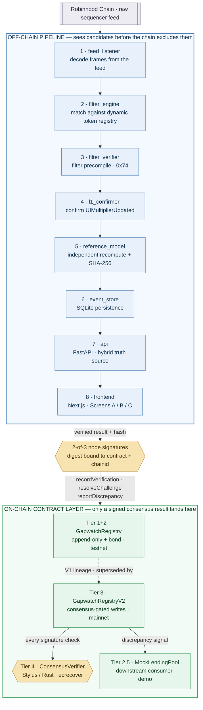

# Gapwatch — Detailed Architecture

This is the expanded form of the overview diagram in the [README](../README.md):
the full 8-module off-chain pipeline and the complete Tier 1–4 contract layer,
including the components the overview collapses into a single box.

Tier 3 and Tier 4 ship together: `GapwatchRegistryV2` (Solidity) delegates every
signature check to `ConsensusVerifier` (Stylus/Rust) through the
`IConsensusVerifier` interface.
